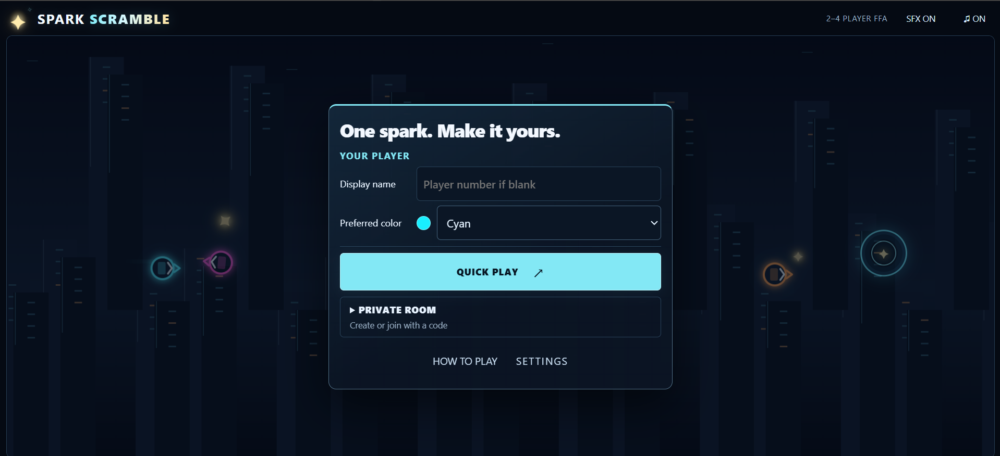
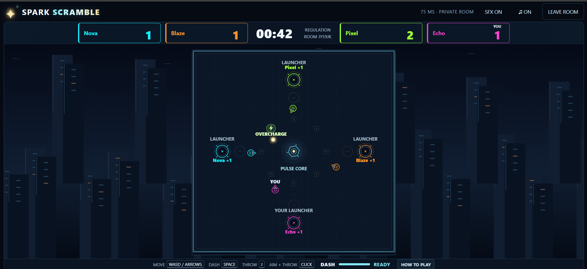

# ⚡ Spark Scramble

**Spark Scramble** is a fast-paced real-time multiplayer arena game for **2–4 players**.

One shared Spark. Chase it down, dash into carriers, intercept throws, and launch it into your own launcher to score.

🎮 **Play the live game:**  
https://sparkscramble.onrender.com

> **Note:** This is the public showcase repository for Spark Scramble. The production source code and active development repository are maintained privately.

## Lobby

Players can choose a display name and color, then jump into Quick Play or create/join a private room.

## Gameplay

Matches revolve around one shared Spark. Players compete for possession, throw and intercept it, body-check carriers, and score by launching the Spark into their own launcher.

## About the game

Spark Scramble began as an experiment in using AI as a development partner throughout an entire product workflow — not only for generating code, but also for planning mechanics, debugging behavior, reasoning through multiplayer edge cases, improving presentation, and designing tests.

The result is a browser-based multiplayer game designed to work across desktop and mobile.

## Features

- Real-time **2–4 player multiplayer**
- Quick Play matchmaking
- Private rooms with room codes
- Server-authoritative scoring and match state
- Dash-based body checks
- Spark pickup, carrying, throwing, catching and interception
- Sudden Death
- Overcharge power-up
- Pulse Core arena event
- Rematches
- Custom player names and colors
- Remappable desktop controls
- Mobile touch controls
- Original procedural sound effects and music
- Built-in How to Play guidance

## Technology

- **JavaScript**
- **Node.js**
- **WebSockets**
- **HTML / CSS**
- **Canvas**
- **Render**

The multiplayer server maintains the authoritative match state while clients handle input, rendering, prediction and presentation.

## Testing

The current web build is covered by:

**175 automated tests**

The project has also been manually tested across desktop and mobile, including multiplayer sessions across separate devices and networks.

Testing covers areas such as:

- multiplayer synchronization
- scoring and match state
- Quick Play matchmaking
- private rooms
- player departure and cleanup
- rematches
- input handling
- desktop and mobile presentation
- audio behavior
- gameplay mechanics
- renderer behavior
- network-delay scenarios

## AI-assisted development

AI was used throughout the development process to assist with:

- feature planning
- implementation
- debugging
- multiplayer edge-case analysis
- UI and presentation refinement
- test design
- regression analysis
- deployment workflows

The project still required hands-on product decisions, repeated multiplayer testing, verification of generated implementations, and iterative refinement.

One of the biggest lessons from the project was that effective AI-assisted development depends less on simply generating code and more on being able to define intended behavior, inspect the result, challenge incorrect assumptions, test thoroughly, and iterate.

## Current status

The web version of Spark Scramble is live.

The project is also being explored further as an **Android application**.

## Source code and repository structure

Spark Scramble is actively developed in a separate **private GitHub repository** that contains the production source code, automated tests, development history, and ongoing implementation work.

The development repository is kept private to protect the project's source code and reduce unnecessary exposure to unauthorized copying, redistribution, or reuse as the project moves beyond its original portfolio phase.

This public repository was created specifically as a **project showcase**. It provides:

- a playable live deployment
- gameplay and lobby screenshots
- an overview of the game's features and technology
- testing and development information
- a public GitHub presence for the project

It intentionally does **not** contain the game's production source code or local build instructions.

🎮 **Play Spark Scramble:**  
https://sparkscramble.onrender.com
